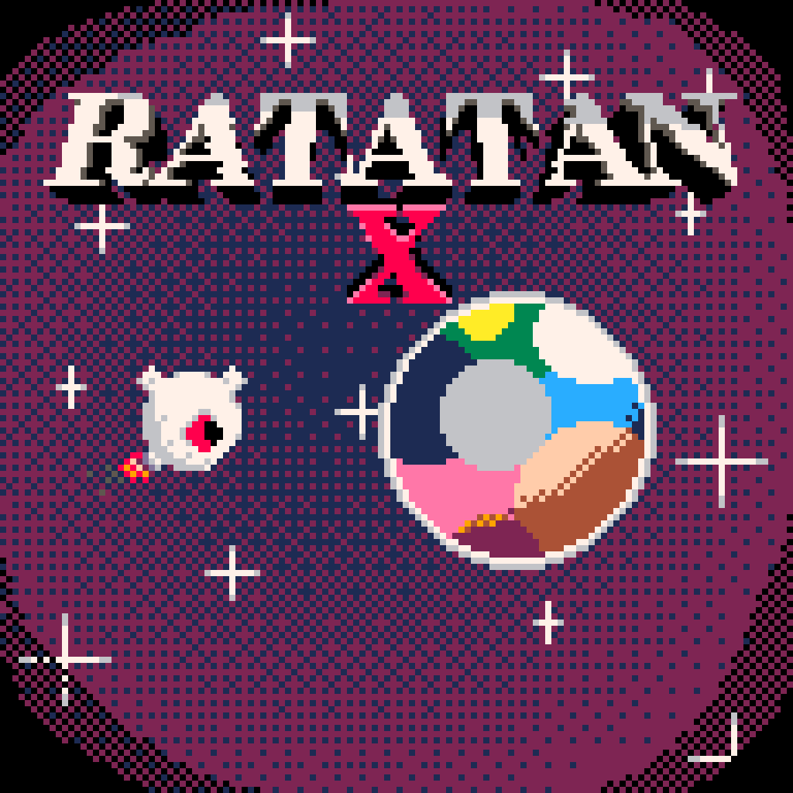

Now officially hosted on Sourcehut at https://git.sr.ht/~unevenprankster/ratatan. Down with the Github.

  'Ratatan' and 'Ratatan X' PICO-8 games

# What's Ratatan about?

A ship that crashes into planets because it's fun. I made each game in about a day. Ratatan is my first ever PICO-8 game, while Ratatan X improved greatly upon it.

## Why is the first one so trash?

It be like that when you make your first game in a new platform.

## Where's the Newgrounds stuff?

That uses very secret and epic private information. Also don't try reposting the game there, I'll personally kick your ass.
